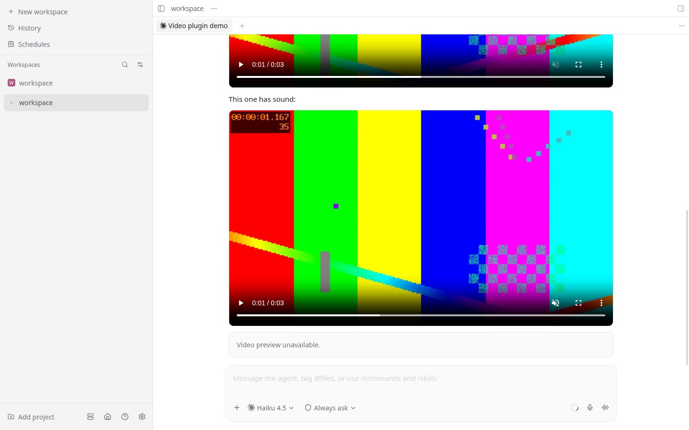

# video-embeds

Renders `` in assistant messages as an inline video player with
controls — mp4, webm, and mov. Agents can show you a screen recording or demo clip in the chat
instead of leaving a file path.



## Install

```bash
paseo plugin add kschniedergers/paseo-plugins --path video-embeds
```

Requires Paseo 0.8.0 or newer.

## Teach your agents to use it

Nothing in Paseo tells agents to embed images or videos; models write `` for screenshots
out of habit, and they will not do it for a `.mp4` unless told. This plugin ships a skill that does
the telling — link it where your agent runtime discovers skills:

```bash
ln -s "$PASEO_HOME/plugins/<checkout>/video-embeds/skills/paseo-video-embeds" ~/.claude/skills/paseo-video-embeds
```

Or drop one line into your global agent instructions (for example `~/.claude/CLAUDE.md`):

> When you have a screen recording or demo clip, embed it as a markdown image with the absolute
> path: `` (mp4/webm/mov, under 30 MB).

## How it works

- A timeline transformer matches `assistant_message` items containing video markdown and splits
  them into prose and video segments. Messages that also embed non-video images are left to the
  host, because a transformer can only replace a whole item with plugin items.
- The renderer fetches bytes over plugin RPC. The daemon-side handler reads the file, resolves
  relative paths against the agent's working directory, expands `~`, enforces a 30 MB cap, and
  checks the container's magic bytes. Failures render as "Video preview unavailable."
- Audio tracks play. Prose inside a transformed message renders as plain text.

## Limits

- Playback is web and desktop only. Plugins cannot ship native modules, so iOS and Android show a
  labeled placeholder card instead of a player.
- Files over 30 MB are refused; re-encode first:
  `ffmpeg -i in.mov -c:v libx264 -crf 28 -pix_fmt yuv420p -c:a aac out.mp4`

## Develop

```bash
npm install
npm run typecheck
npm test
paseo plugin install /absolute/path/to/paseo-plugins/video-embeds   # directory source
paseo plugin reload video-embeds                                    # after edits
```
